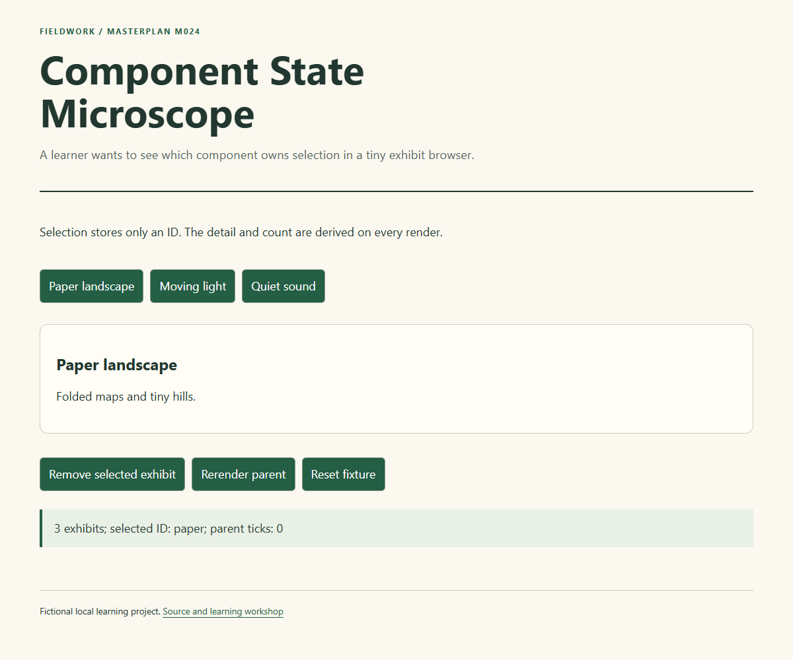

# M024 — Component State Microscope

A learner wants to see which component owns selection in a tiny exhibit browser.

This is a complete small **reference implementation and learning workshop** for MASTERPLAN builds M011–M025. Study the choices, then make your own variation. The reference is finished; the exercises and your journal are deliberately unfinished.

**Main skill:** React components and minimal state. **Study pairing:** existing curriculum #38, [recipeweb](https://github.com/elirc/recipeweb). [Previous](https://github.com/elirc/masterplan-023-import-preview-tray) · [Next](https://github.com/elirc/masterplan-025-saved-view-composer)

## Run it

Use Git and Node.js 22 or newer. M024 and M025 use pinned React, ReactDOM and esbuild packages. Install the committed lockfile with npm ci.

```sh
git clone https://github.com/elirc/masterplan-024-component-state-microscope.git
cd masterplan-024-component-state-microscope
npm ci
npm test
npm start
```

Open http://127.0.0.1:4300 and leave the terminal running. Stop with Ctrl+C. Run one project at a time, or use a different PORT for a second server. On PowerShell: `$env:PORT=4301` before `npm start`. The preview serves only public/ on your own computer. For the React builds, npm start first builds the JSX source into an ignored local bundle.

`private: true` in package.json prevents accidental npm publication; it does not make this GitHub repository private. The GitHub repository is intended to be public.

## What the reference promises

The React parent stores an item list, a selected ID and an unrelated rerender counter. Detail content and item count are derived on every render. Child components receive data and callbacks through props. Removing the selected item produces an explicit empty detail without copying a stale selected object. An unrelated parent rerender preserves selection; reset restores the fixture. Data is in memory and reload resets it.

Borrows the cookbook's component-reading lens for a small unrelated product, with no recipe cloning.

## Read in this order

1. [Learning route](docs/00-START-HERE.md): a manageable session plan and readiness check.
2. [Build walkthrough](docs/01-BUILD-WALKTHROUGH.md): build from requirements to the smallest verified result.
3. [Concepts and execution traces](docs/02-CONCEPTS-AND-TRACES.md): predict, trace and explain the real code.
4. [Code tour and architecture choices](docs/03-CODE-TOUR.md): exact files and responsibilities.
5. [Debugging laboratory](docs/04-DEBUGGING-LAB.md): one worked diagnosis and two guided investigations.
6. [Six learner stories](docs/05-PRACTICE-STORIES.md): features and fixes with plans, acceptance criteria and decisions left to you.
7. [Hints and answer directions](docs/06-HINTS-AND-ANSWERS.md): consult after an attempt.
8. [Agentic coaching prompts](docs/07-AGENTIC-COACHING.md): ask for help without outsourcing the learning.
9. [Build journal and decision narrative](docs/08-BUILD-JOURNAL.md): a retrospective explanation grounded in the actual implementation.
10. [Verification](docs/VERIFICATION.md) and [blank journal](docs/JOURNAL-TEMPLATE.md).



## Know what the checks prove

npm test runs the pure JavaScript boundary regressions. Browser evidence separately covers form interaction, error recovery, layout and keyboard entry.

This is a local educational example with fictional content. There is no production deployment, external data integration, tracking, authentication or payment flow. Do not mistake the deliberately small scope for a template that already solves those additional concerns.

## Your first independent task

Add a search field: Store the query in the parent and derive a visible list; decide whether filtering hides or clears the selected detail. Read its acceptance criteria, create a practice branch, and write your prediction before changing code. Keep your personal notes in `my-journal/`, which is ignored by Git.
